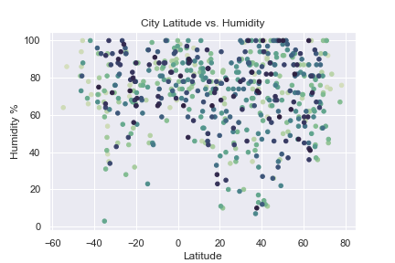
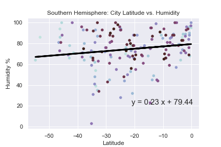
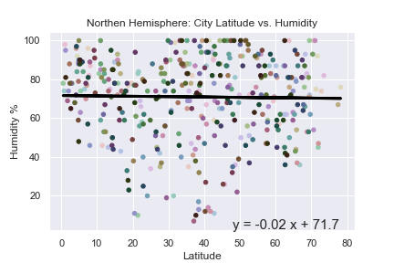
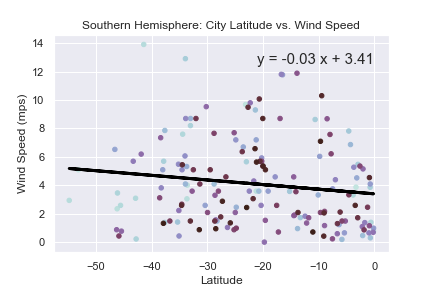
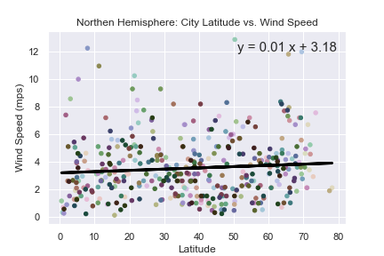

# Python API Exercise - Weather

We all know that if we get closer to the equator the temperature gets higher, but can you prove it? This exercise focuses on it.

## Data

For this example, I generated random latitudes and longitudes varing from +/-90 case of latitude and +/-180 for longitude. From it, using citypy, I detected the nearest city and generated a city list. This list was use to locate the weather information from the OpenWeatherMap API, to create a representative model of weather across world [cities](Resources/cities.csv).

### Objective

Analize the information retrived with visual help from `matplotlib`.

* Temperature (C) vs. Latitude
* Humidity (%) vs. Latitude
* Cloudiness (%) vs. Latitude
* Wind Speed (mph) vs. Latitude

Divide by Hemispheres and review the same information as before, looking for correlation between the data.

Create a heatmap with the aid of `gmaps` with the humidity for the cities. Identifing an ideal weather, find the nearest hotel to the cities that have the ideal weather conditions.
Create an ideal weather and 

## Results

* General visualizations

  * Temperature (C) vs. Latitude

    

    In this plot we can see that as we get away from the Equator the max temperature decreses, but we see a more significant decrease in the north of the planet.

  * Humidity (%) vs. Latitude

    

    As far as this chart shows, there is no relation between the latitude and the % humidity.

  * Cloudiness (%) vs. Latitude

    

    Again, it appears as it there is no relation between the latitude and the % cloudiness.

  * Wind Speed (mph) vs. Latitude

    

    In here also, there is no relation between the latitude and the wind speed.

* By Hemispher

  * Temperature (C) vs. Latitude

     

    As we stated before, the temperatures drop as we get away from the Equator more pronounce in the northern hemisphere, probably due earth oval shape.

  * Humidity (%) vs. Latitude

     

    The behaviour in both hemispheres are similar (mirroring), both with a +- 0.5 slope.

  * Cloudiness (%) vs. Latitude

     

    There seems to be a higher correlation between the southern hemisphere than in the northern hemisphere. And is notorious that both hemisphere behave similar instead of in a mirroring way as would be standard.

  * Wind Speed (mph) vs. Latitude

     

    There seems to be no significant correlation between the latitude and the wind speed.

* HeatMap with `gmaps`

  

* Map with hotesl for the cities with ideal weather.

  

### Copyright

Trilogy Education Services © 2019. All Rights Reserved. First image retrived from OpenWeatherMap site on 07/08/2020.
